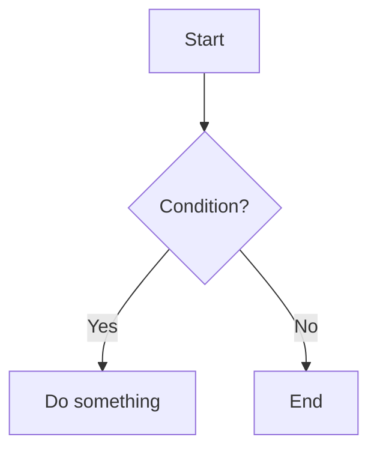
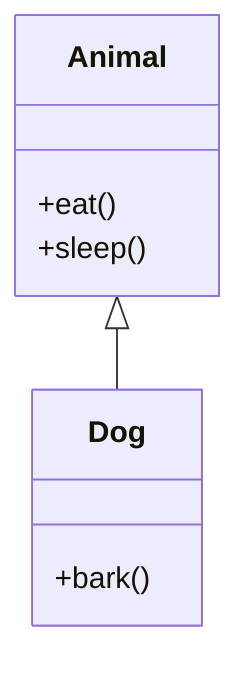

下面給你一段**長篇、內容豐富、涵蓋多種 Markdown 要素**的大型 Markdown 文件。
包含：

* 標題階層（1–6）
* 內文段落（長段落）
* 程式碼區塊（多語言）
* 引用（單層、多層）
* 代辦清單
* 表格
* 數學公式（KaTeX/MathJax）
* 註腳
* 連結、圖片（示意用）
* 分隔線
* 折疊區塊（details/summary）
* 引文、警告框（一般 Markdown 寫法）
* Mermaid 圖
* JSON、YAML、Python、C++ 程式碼
* 多重列表（有序、無序、混合）

足以測試大部分 Markdown 處理器。

---

# **Complex Markdown Document Example**

本文件展示一個極度完整且內容繁多的 Markdown 範例，目的在於測試各種排版、渲染、與轉 PDF 行為。
段落文字刻意拉長，以方便測試分頁與行距等問題。

在現代技術文件中，Markdown 已成為主流的輕量標記語言。透過適當的擴充，它可以用於撰寫 API docs、技術規格、筆記、論文草稿，甚至是整個網站的內容系統。

---

## **1. Introduction**

Markdown 的核心價值在於「可讀性」與「低摩擦」。
以下展示的內容包含各種常見與進階的 Markdown 功能。

### **1.1 Features included**

* 標題階層
* 引用、代辦清單、程式碼片段
* Mermaid 圖、表格、數學公式
* 多層清單、折疊內容、註腳

### **1.2 Example paragraph**

以下是一段較長的段落文字，用於測試分頁與換行效果：
Lorem ipsum dolor sit amet, consectetur adipiscing elit. Vivamus fermentum, lacus vitae tempus ullamcorper, libero lorem finibus velit, at interdum nisi arcu sed metus. Vestibulum eget malesuada sapien. Suspendisse bibendum lectus sed sem viverra, nec interdum massa vulputate. Fusce ut ex augue. Mauris consectetur justo id ligula facilisis, quis placerat erat auctor.

---

# **2. Quote & Blockquote Examples**

> 這是一段單層引用。
>
> 其中包含一般文字、`inline code`、粗體 **bold** 與斜體 *italic*。

多層引用：

> 第一層
>
> > 第二層
> >
> > > 第三層
> > > Lorem ipsum dolor sit amet, consectetur adipiscing elit.

---

# **3. Code Blocks**

## **3.1 Python**

```python
import numpy as np

def softmax(x):
    e = np.exp(x - np.max(x))
    return e / e.sum()

print(softmax(np.array([1.0, 2.0, 3.0])))
```

## **3.2 C++**

```cpp
#include <iostream>
#include <vector>
using namespace std;

int main() {
    vector<int> v = {1, 2, 3, 4};
    for (int x : v) cout << x << " ";
    return 0;
}
```

## **3.3 JSON**

```json
{
  "name": "example",
  "version": 1.0,
  "features": ["markdown", "latex", "mermaid"]
}
```

## **3.4 YAML**

```yaml
project:
  name: test-doc
  language: markdown
  enabled: true
```

---

# **4. Math Examples**

## **4.1 Inline Math**

這是 inline：

$$ f(x_1,x_2,\underbrace{\ldots}_{\rm ldots} ,x_n) = x_1^2 + x_2^2 + \underbrace{\cdots}_{\rm cdots} + x_n^2 $$

$$\sum_{i=1}^n \frac{1}{i^2} \quad and \quad \prod_{i=1}^n \frac{1}{i^2} \quad and \quad \bigcup_{i=1}^{2} R$$


$$
f\left(
   \left[
     \frac{
       1+\left\{x,y\right\}
     }{
       \left(
          \frac{x}{y}+\frac{y}{x}
       \right)
       \left(u+1\right)
     }+a
   \right]^{3/2}
\right)
\tag{行標}
$$

## **4.2 Block Math**

$$
        \begin{matrix}
        1 & x & x^2 \\
        1 & y & y^2 \\
        1 & z & z^2 \\
        \end{matrix}
$$

$$
        \begin{pmatrix}
        1 & a_1 & a_1^2 & \cdots & a_1^n \\
        1 & a_2 & a_2^2 & \cdots & a_2^n \\
        \vdots & \vdots & \vdots & \ddots & \vdots \\
        1 & a_m & a_m^2 & \cdots & a_m^n \\
        \end{pmatrix}
$$

## **4.3 system of equations**
$$
\left\{
\begin{array}{c}
a_1x+b_1y+c_1z=d_1 \\
a_2x+b_2y+c_2z=d_2 \\
a_3x+b_3y+c_3z=d_3
\end{array}
\right.
$$

---

# **5. Tables**

| Name | Type  | Value | Description          |
| ---- | ----- | ----- | -------------------- |
| a₁   | int   | 42    | The answer to life   |
| β₂   | float | 1.234 | Greek symbol example |
| item | str   | "hi"  | Simple example       |

---

# **6. Lists**

## **6.1 Unordered**

* Apple
* Banana
* Orange

  * Sub-level

    * Sub-sub-level

## **6.2 Ordered**

1. Step one
2. Step two
3. Step three

   1. Nested step
   2. Another step

## **6.3 To-do List**

* [x] Write markdown
* [ ] Add LaTeX
* [ ] Export to PDF
* [x] Include Mermaid diagram

---

# **7. Mermaid Diagrams**

流程圖：



UML 類別圖：



---

# **8. Collapsible Sections**

<details>
<summary><strong>點我展開內容</strong></summary>

這是一段折疊起來的內容。
可用於 FAQ、補充說明、長段落等。
Markdown 本身沒有提供折疊功能，但 HTML 的 `<details>` 與 `<summary>` 可以直接用。

</details>

---

# **9. Images**

（示意用，實際圖片需自行替換）

```md

```

---

# **10. Footnotes**

這是一句會引用註腳的句子[^note1]。

[^note1]: 這是註腳內容。

---

# **11. Horizontal Rules**

---

---

# **12. Very Long Paragraph for PDF Stress Test**

Lorem ipsum dolor sit amet, consectetur adipiscing elit. Cras malesuada porta risus sit amet lacinia. Vivamus maximus, purus nec auctor tincidunt, ipsum nunc dapibus erat, vel hendrerit elit nunc sed turpis. Aliquam erat volutpat. Donec efficitur rutrum orci, et euismod orci bibendum vitae. Integer consequat sem a lorem tempus, vitae volutpat lacus vestibulum. Etiam mollis bibendum lorem, nec tristique ligula congue id. Sed malesuada justo a turpis tempus, sit amet ultricies lectus tempor. Curabitur aliquam vehicula vulputate. Suspendisse tempor luctus est, at rhoncus sapien bibendum sit amet.

---
